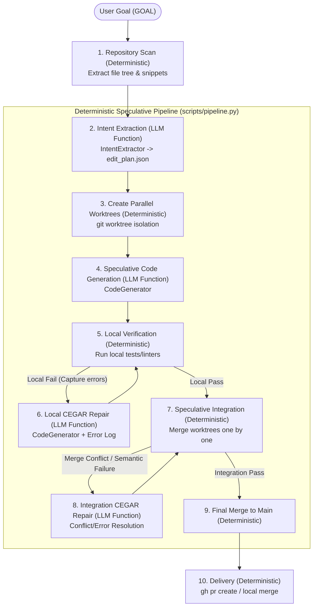

# AI Org Bootstrap Antigravity

> 🤖 **Antigravity-Native Autonomous SDLC Engine**
> A goal goes in, verified Git PRs come out. Built entirely using the Google Antigravity Python SDK.

---

## 1. Overview

**AI Org Bootstrap Antigravity** is a complete, completely redesigned implementation of the autonomous software organization framework. Instead of treating AI agents as standalone actors or wrapping them in complex CLI subprocesses, this engine runs natively using the **Google Antigravity Python SDK (`google-antigravity`)**.

It models a complete software development team (designers, implementers, security/QA reviewers) backed by a **deterministic, Git-integrated Python kernel**.

---

## 2. Paradigm Shift: Codex vs. Antigravity

| Dimension | Old Codex Build (`ai-org-bootstrap-codex`) | New Antigravity Build (`ai-org-bootstrap-antigravity`) |
| :--- | :--- | :--- |
| **Runtime Boundary** | Subprocess execution of external `codex` TUI/CLI binaries. | Programmatic Python integration via `google.antigravity.Agent` API. |
| **Agent Config** | TOML adapters (`.codex/agents/*.toml`). | Pydantic-based `LocalAgentConfig` & `CapabilitiesConfig`. |
| **Session Control** | Manual server-side session tracking and recovery. | SDK-native async context managers (`async with Agent(...)`). |
| **Tool Execution** | Custom script-based mock shell executions. | Strongly-typed, SDK-managed tools with native permission gates. |
| **State Persistence** | Lightweight JSON logs + manual Git refs. | Git-backed goal store (`refs/goals/`) integrated into Python lifecycle. |

---

## 3. Speculative Parallel Architecture

The engine is built on a **"Deterministic-First, LLM-as-a-Service"** paradigm. The core pipeline is orchestrated 100% deterministically by Python and Git, while the LLM (Antigravity SDK) is invoked purely as targeted, stateless code-transformation functions.

It utilizes **Speculative Parallel Execution** to maximize throughput, running all tasks concurrently in isolated Git worktrees and resolving merge conflicts or semantic inconsistencies at integration time:



---

## 4. Directory Structure & Core Components

- **`AGENTS.md`**: Directives and bootstrap rules for AI agents running in this repo.
- **`bootstrap/`**: Rules of engagement (`carrier-discipline.md`) and launch lifecycles.
- **`roles/`**: Markdown-based system instructions for each of the 10 specialized agent roles.
- **`schemas/`**: Pydantic/JSON schemas gating the handoffs between roles (e.g., design contracts, verification results).
- **`scripts/`**: The deterministic Python backbone:
  - `carrier.py`: SDK-native async carrier harness wrapping `google.antigravity.Agent`.
  - `controller_pipeline.py`: The Dialectic coordinator (Design -> Synthesize -> Implement -> Verify).
  - `controller_goal.py`: The Autonomous Builder / Splitter-Queue main entry point.
  - `splitter.py`: Goal decomposition engine.
  - `frontier.py`: Task DAG model.
  - `goal_store.py`: Git-backed state persistence (`refs/goals/`).
  - `border_collie.py`: Non-blocking event log patroller.
  - `contract_patch.py`: Deterministic schema patch utility.

---

## 5. Getting Started

### Prerequisites
Make sure you are running in a Python virtual environment with the `google-antigravity` SDK installed:

```sh
source .venv/bin/activate
pip install -r requirements.txt
```

### Running a Goal
To run the autonomous builder against a target workspace:

```sh
python3 scripts/controller_goal.py \
  --repo /path/to/target-workspace \
  --goal "Implement a responsive dark-theme landing page under /src/components"
```

Observe the live progress by tailing the stream log:
```sh
tail -f /path/to/target-workspace/.agent-runs/stream.jsonl
```

### 5.3. Running the Speculative Parallel Demo

To see a complete, plug-and-play demonstration of the speculative parallel pipeline in action:

1. Run the interactive demo setup script at the root of the repository:
   ```sh
   python3 run_demo.py
   ```
2. The script will create a `demo_workspace` with multiple bugs in `math_utils.py` and failing tests in `test_math.py`.
3. If credentials are set, it will offer to run the pipeline automatically. Otherwise, it will print the exact commands to run the speculative builder in parallel using the Gemini API or Vertex AI.

